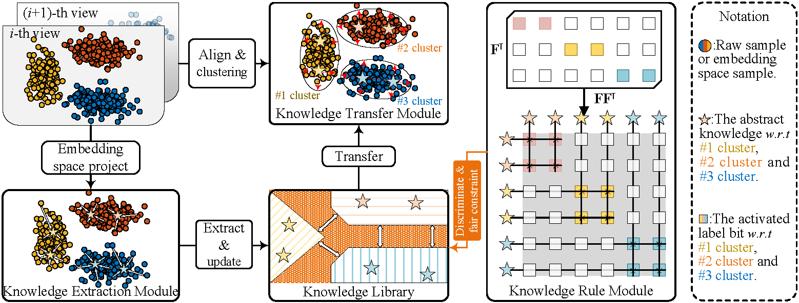

# LSVC: A Lifelong Learning Approach for Stream View Clustering

## Introduction
Multi-view clustering leverages complementary information from multiple perspectives to achieve more accurate results than traditional single-view methods. However, existing multi-view clustering techniques require all views to be available upfront, making them inadequate for handling streaming data sources, such as stem cell analysis and multi-camera surveillance.

To address this issue, we propose **Lifelong Stream-View Clustering (LSVC)**, which incorporates an embedding anchor knowledge library and three key components, enabling asynchronous clustering on stream views:

1. **Knowledge Extraction Module**: Extracts abstract knowledge from incoming views over time and updates the shared knowledge library.
2. **Knowledge Transfer Module**: Aligns the new view with the historical knowledge library, enabling the transfer of structural information.
3. **Knowledge Rule Module**: Constrains the knowledge library to ensure a fair distribution of anchors for each cluster, improving knowledge discrimination.

Experimental results demonstrate that LSVC outperforms traditional single-view and multi-view clustering methods.

For more details, refer to our paper: [DOI: 10.1109/TNNLS.2024.3439394](https://doi.org/10.1109/TNNLS.2024.3439394)

## Framework Overview


## Installation
Ensure you have MATLAB installed with the required toolboxes. Clone this repository using:

```sh
git clone https://github.com/your-repo/LSVC.git
cd LSVC
```

## Usage
To run the LSVC demo, simply execute:

```matlab
run demo.m
```

## Notes
- Since LSVC operates in an embedding space, **views with feature dimensions lower than the embedding space feature dimension will be ignored**.
- Due to unknown reasons, there may be **performance differences between the first run and subsequent runs when using `parfor`**. Please take special note of this.


## License
This project is licensed under the BSD 2-Clause License. See the LICENSE file for details.

